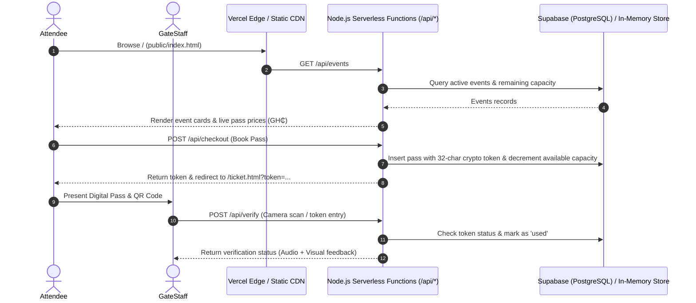

# GatherPass — Smart Event Companion (Vercel + Supabase)

> **Discover an event → review details → book a pass → receive a QR pass → verify entry**

GatherPass is an end-to-end event ticketing and admission web platform built for native **Vercel Serverless** deployment with a lightweight **HTML/CSS/JavaScript** frontend, **Node.js/TypeScript** serverless API routes, and a hosted **Supabase (PostgreSQL)** database (with an integrated in-memory fallback store).

## Alexa+ simulated experience

GatherPass includes a clearly labeled web-based Alexa+ simulation at [`/assistant.html`](public/assistant.html). It demonstrates the conversational flow planned for an event companion:

1. An attendee asks for events using natural language, such as “find tech events in Accra”.
2. The simulation searches the same `/api/events` endpoint used by the main product, prioritizing an exact event-title match before falling back to location and topic keywords.
3. It returns matching events with date, venue, and price details.
4. The attendee can continue directly into the existing pass-booking flow.

This is an **honest simulation**, not a live Alexa Skill or MCP server. Its source code is included in the repository so the interaction model is inspectable and reproducible.

---

## Architecture Overview



---

## Cloud Integration Roadmap & Amazon AWS Services

GatherPass includes adapters and architecture targets for AWS cloud services with clear status indicators:

| Service | Category | Status | Implementation Details |
| :--- | :--- | :--- | :--- |
| **Amazon S3** | Flyer & Banner Storage | **Prototype** (Live with AWS keys) | Flyer upload handler in `/api/upload` streams to Amazon S3 when credentials are set, with fallback to local/CDN storage. |
| **Amazon CloudWatch** | Admission Telemetry & Metrics | **Prototype** (Live with AWS keys) | Telemetry logger in `lib/aws.ts` records `TICKET_RESERVED`, `ENTRY_GRANTED`, and `ENTRY_REJECTED` audit metrics. |
| **AWS KMS** | Key Management & Signature | **Planned** | Planned architecture for hardware-backed HSM token signing keys. |
| **Amazon SES** | Pass Email Dispatch | **Prototype** (Live with AWS keys) | Notification dispatcher in `lib/aws.ts` triggers transactional pass confirmation emails. |

### Enabling Live AWS Integration (Optional)
To activate live Amazon S3, SES, and CloudWatch streaming, configure these environment variables in your Vercel project or `.env.local`:
```env
AWS_REGION=us-east-1
AWS_ACCESS_KEY_ID=your_aws_access_key_id
AWS_SECRET_ACCESS_KEY=your_aws_secret_access_key
AWS_S3_BUCKET=gatherpass-event-assets
AWS_SES_SENDER=tickets@gatherpass.com
```

*(When AWS credentials are not present, GatherPass runs in **Prototype** mode using local storage emulation and local logging without breaking).*

---

## Instant Deployment to Vercel

### Step 1: Set up Supabase Database (Optional)
1. Create a free project on [Supabase](https://supabase.com).
2. Open the **SQL Editor** in your Supabase dashboard.
3. Paste and run the contents of [`supabase_schema.sql`](supabase_schema.sql). This creates the `events` and `tickets` tables, configures Row-Level Security (RLS), and seeds clean demo data (Tickets Sold: 0, Tickets Remaining: Capacity, Revenue: GH₵0.00).
4. Copy your **Project URL**, **Anon Key**, and **Service Role Key** from `Project Settings > API`.

### Step 2: Deploy to Vercel
1. Push this repository to GitHub / GitLab.
2. Import the project into [Vercel](https://vercel.com/new).
3. In **Environment Variables**, add:
   - `SUPABASE_URL` = `https://your-project-ref.supabase.co`
   - `SUPABASE_ANON_KEY` = `your_anon_key`
   - `SUPABASE_SERVICE_ROLE_KEY` = `your_service_role_key`
4. Click **Deploy**. Vercel will build static assets and serverless functions under `/api`.

*(Note: If Supabase environment variables are omitted, GatherPass automatically uses its embedded in-memory database store so everything works immediately out of the box).*

---

## Local Development

1. Install dependencies:
   ```bash
   npm install
   ```
2. Start the local server:
   ```bash
   npm run dev
   ```
3. Open `http://localhost:3000` in your browser.

---

## Project Structure

```
GatherPass/
├── api/                    # Node.js/TypeScript Serverless API Functions
│   ├── events.ts           # GET /api/events (events list, search, details)
│   ├── checkout.ts         # POST /api/checkout (pass reservation & pricing)
│   ├── ticket.ts           # GET /api/ticket?token=... (fetch digital pass)
│   ├── verify.ts           # POST /api/verify (Gate Scanner check-in validation)
│   ├── planner.ts          # GET/POST/PUT/PATCH /api/planner (Organizer metrics)
│   └── upload.ts           # POST /api/upload (Flyer image uploader)
├── lib/
│   ├── aws.ts              # AWS Cloud integration layer (S3, SES, CloudWatch)
│   └── db.ts               # Supabase data layer with clean initial state fallback
├── public/                 # Vanilla HTML5 / CSS3 / JavaScript Frontend
│   ├── index.html          # Public Homepage: Discover Events & Organizer link
│   ├── event.html          # Pass Details & Checkout (Book Pass)
│   ├── ticket.html         # Digital Pass with High-Contrast QR Code
│   ├── verify.html         # Gate Scanner (Camera / File / Token verification)
│   └── planner/
│       ├── index.html      # Organizer Planner Dashboard (5 KPIs & attendee stream)
│       ├── create.html     # Create Event Studio
│       └── event-manage.html# Event Management Hub
├── supabase_schema.sql     # Supabase PostgreSQL schema with clean initial seed data
├── server.js               # Local Node.js development server
├── vercel.json             # Vercel routing rules & rewrites
└── package.json            # Project dependencies
```

---

## Standardized Terminology & Design System

- **Product Name**: `GatherPass`
- **User-Facing Ticket**: `Pass`
- **Event Creators**: `Organizer`
- **Verification Tool**: `Gate Scanner`
- **Main Action CTA**: `Book Pass`
- **Currency**: Ghanaian cedi (`GH₵`), formatted as `GH₵150.00`
- **Gate Entry Status Responses**:
  - `Valid — entry approved` (Green badge + Audio chime)
  - `Already used — entry denied` (Amber badge + Warning tone)
  - `Invalid ticket — entry denied` (Red badge + Error buzz)

---

## API Reference

### `GET /api/events`
- `?search=tech`: Filters events by title, description, or venue.
- `?id=1`: Returns full event details with computed 5% platform fee and ticket totals.

### `POST /api/checkout`
Body:
```json
{
  "event_id": 1,
  "buyer_name": "Kwame Mensah",
  "buyer_email": "kwame@example.com",
  "buyer_phone": "+233240000000",
  "quantity": 2
}
```
Response:
```json
{
  "success": true,
  "token": "4f8a91b2c3d4e5f67890abcdef123456",
  "ticket": { ... }
}
```

### `POST /api/verify`
Body:
```json
{
  "token": "4f8a91b2c3d4e5f67890abcdef123456"
}
```
Response:
```json
{
  "success": true,
  "status": "valid",
  "title": "Valid — entry approved",
  "message": "Valid pass. Guest is cleared for entry.",
  "ticket": { ... }
}
```

### `GET /api/planner`
Returns organizer dashboard metrics, active & draft event lists, and recent bookings.

---

## License
MIT. Created for the GatherPass platform.
